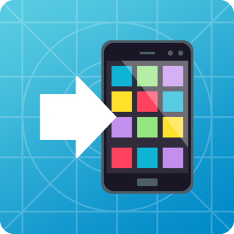

# Icon Magic 📲 🕴 ✨
A helpful script that uses [GraphicsMagick for node.js](http://aheckmann.github.io/gm/docs.html) and [imagemin](https://github.com/imagemin/imagemin) + [imagemin-Zopfli](https://github.com/imagemin/imagemin-zopfli) to resize, optimize, and prefix your "Add to Homescreen" icons for Apple and Android devices from a single .png image.

## Usage:

🛑 ⚠️  Make sure you have [GraphicsMagick](http://www.graphicsmagick.org/) installed on your machine and available on the command-line. (Mac OS users with [HomeBrew](https://brew.sh/) can `brew install graphicsmagick`)

```js
// Install globally via npm (or yarn)
npm install icon-magic -g

// The cli takes a single argument– a source image path
// (Your image must be a square .png file, larger than 512x512)
icon-magic ./sample.png

// If everything is successful, you should have a directory named 'icons'
// with all the prefixed, resized, and optimized images! 🎉
```

## Markup:
```html
<link rel="shortcut icon" href="./path/to/icons/favicon.png">
<!-- Apple Guidelines: https://developer.apple.com/library/content/documentation/AppleApplications/Reference/SafariHTMLRef/Articles/MetaTags.html -->
<link rel="apple-touch-icon" href="./path/to/icons/apple-touch-icon-60x60.png" />
<link rel="apple-touch-icon" sizes="120x120" href="./path/to/icons/apple-touch-icon-120x120.png" />
<link rel="apple-touch-icon" sizes="152x152" href="./path/to/icons/apple-touch-icon-152x152.png" />
<link rel="apple-touch-icon" sizes="167x167" href="./path/to/icons/apple-touch-icon-167x167.png" />
<link rel="apple-touch-icon" sizes="180x180" href="./path/to/icons/apple-touch-icon-180x180.png" />
<meta name="apple-mobile-web-app-title" content="App Title">
<meta name="apple-mobile-web-app-capable" content="yes">
<meta name="apple-mobile-web-app-status-bar-style" content="black">
<!-- Android Guidelines: https://developers.google.com/web/fundamentals/engage-and-retain/web-app-manifest/-->
<link rel="manifest" href="./path/to/manifest.json">
<meta name="theme-color" content="#009ad3">
```

```js
/* Manifest.json– see Android Guidelines above for configuration options */
{
  "short_name": "App Title",
  "name": "A bit longer of an App Title",
  "start_url": "./path/to/index.html",
  "icons": [
    {
      "src": "./path/to/icons/pwa-icon-192x192.png",
      "sizes": "192x192",
      "type": "image/png"
    },
    {
      "src": "./path/to/icons/pwa-icon-256x256.png",
      "sizes": "256x256",
      "type": "image/png"
    },
    {
      "src": "./path/to/icons/pwa-icon-384x384.png",
      "sizes": "384x384",
      "type": "image/png"
    },
    {
      "src": "./path/to/icons/pwa-icon-512x512.png",
      "sizes": "512x512",
      "type": "image/png"
    }
  ],
  "background_color": "#f5f5f5",
  "theme_color": "#009ad3",
  "display": "standalone",
  "orientation": "portrait"
}
```


## Guidelines

Browser and Mobile OS vendors have different methods for handling web apps on their different devices. These are always changing and seem to be quite opinionated. If you feel that something is out-of-date with this script, feel free to open an issue and submit a pull request!

[[Apple Guidelines]](https://developer.apple.com/library/content/documentation/AppleApplications/Reference/SafariWebContent/ConfiguringWebApplications/ConfiguringWebApplications.html) [[Google Guidelines]](https://developers.google.com/web/fundamentals/design-and-ui/browser-customization/#provide_great_icons_tiles)


## Example:
`npm start ./sample.png`

| Filename                     | Image                                                    |
| ---------------------------- | -------------------------------------------------------- |
| favicon.png                  |     |
| apple-touch-icon-60x60.png   |     |
| apple-touch-icon-120x120.png |  |
| apple-touch-icon-152x152.png |  |
| apple-touch-icon-167x167.png |  |
| apple-touch-icon-180x180.png |  |
| pwa-icon-192x192.png         |                  |
| pwa-icon-256x256.png         |                  |
| pwa-icon-384x384.png         |                  |
| pwa-icon-512x512.png         |                  |
